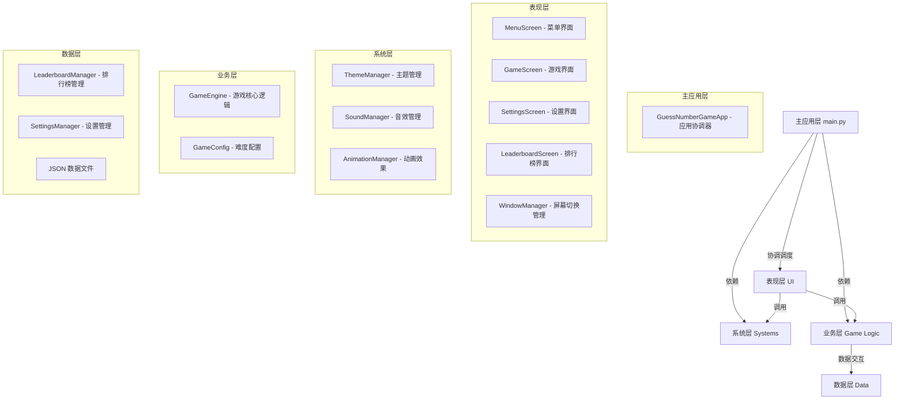

# 猜数字小游戏 (Guess Number Game) 🎮
一个**功能完整、架构清晰、教学价值高**的 Python GUI 猜数字小游戏，支持多难度选择、主题切换、音效反馈、数据持久化等核心功能，采用模块化设计，易于扩展和维护。

## 📖 项目介绍
这是一款面向 Python 初学者的 GUI 实战项目，基于模块化架构设计实现了经典的猜数字游戏，涵盖 **UI 设计、业务逻辑、数据持久化、音效/主题管理** 等完整开发环节，既适合入门学习，也可作为 Python GUI 项目的参考案例。

## ✨ 核心功能
| 功能项 | 详情 |
|--------|------|
| 多难度选择 | 简单(1-50, 10次机会)、中等(1-100, 7次机会)、困难(1-200, 5次机会) |
| 完整UI体系 | 4个核心屏幕：菜单页、游戏页、设置页、排行榜页 |
| 主题系统 | 浅色/深色主题实时切换，无需重启应用 |
| 音效反馈 | 猜对/猜错/游戏结束等场景的专属音效提示（预留音频集成接口） |
| 排行榜功能 | 自动记录各难度下的最好成绩，支持按难度筛选查看 |
| 数据持久化 | 用户设置（主题/默认难度）、排行榜数据自动保存到 JSON 文件，重启不丢失 |

## 🏗️ 架构设计
项目采用**分层模块化架构**，职责清晰、低耦合，便于维护和扩展：



## 📂 项目目录结构
```
e:\CX\cctest\
│
├── 📂 game/                      # 核心游戏模块
│   ├── __init__.py
│   ├── config.py                 # 难度配置类(EASY/MEDIUM/HARD/CUSTOM)
│   └── engine.py                 # GameEngine - 游戏核心逻辑
│
├── 📂 ui/                        # 用户界面模块
│   ├── __init__.py
│   ├── window_manager.py         # WindowManager/Screen 屏幕管理
│   ├── screens.py                # 4个屏幕类 (Menu/Game/Settings/Board)
│   └── animation.py              # AnimationManager - 动画效果
│
├── 📂 systems/                   # 系统功能模块
│   ├── __init__.py
│   ├── theme.py                  # ThemeManager - 主题管理(亮/暗)
│   └── sound.py                  # SoundManager - 音效管理
│
├── 📂 data/                      # 数据管理模块
│   ├── __init__.py
│   ├── leaderboard.py            # LeaderboardManager - 排行榜持久化
│   └── settings.py               # SettingsManager - 设置持久化
│
├── 📂 assets/                    # 资源文件夹
│   ├── sounds/                   # 音效文件（预留，可自行添加音频）
│   └── leaderboard.json          # 排行榜数据文件（运行时自动生成）
│
├── constants.py                  # 全局常量定义（颜色、路径、配置等）
├── main.py                       # 应用入口（核心启动文件）
├── number_game.py                # 旧版单文件游戏（已弃用，仅留存参考）
└── hello.py                      # 初始 Hello World 示例
```

## 🚀 运行说明
### 环境要求
- Python 3.8+（推荐 3.9/3.10）
- 依赖：仅需 Python 标准库（Tkinter，默认自带，无需额外安装）

### 运行步骤
1. 克隆/下载本仓库到本地
2. 进入项目根目录（`e:\CX\cctest\`）
3. 执行启动命令：
   ```bash
   python main.py
   ```
4. 首次运行会自动生成：
   - `assets/leaderboard.json`（排行榜数据文件）
   - `data/settings.json`（用户设置文件，默认：浅色主题、中等难度）

## 🎮 游戏使用指南
### 1. 主菜单操作
启动后自动进入主菜单，可选择：
- 🎯 开始游戏：进入游戏界面，按当前难度开始猜数字
- ⚙️ 设置：调整默认难度、切换主题（浅色/深色）
- 📜 排行榜：查看各难度下的历史最好成绩
- 🚪 退出：关闭应用（自动保存所有数据）

### 2. 游戏流程
1. 输入猜测的数字，点击「提交」或按回车
2. 界面实时反馈：「太小了」「太大了」「猜对了！」
3. 剩余次数实时显示，用尽则游戏结束（显示正确答案）
4. 猜对后自动记录成绩到排行榜，可选择「重新开始」或「返回菜单」

### 3. 数据保存
- 所有设置（主题/默认难度）自动保存到 `data/settings.json`
- 排行榜数据自动保存到 `assets/leaderboard.json`
- 关闭应用后重新打开，数据完全保留

## 🌟 项目亮点
| 亮点 | 详情 |
|------|------|
| 模块化设计 | 各功能独立拆分，模块间通过接口通信，低耦合、易维护 |
| 功能完整性 | 覆盖「玩游戏-调设置-看排行」全流程，满足实际使用需求 |
| 可扩展性 | 轻松添加新难度、新主题、音频文件，或扩展网络排行榜/数据库存储 |
| 友好体验 | 纯中文界面、实时反馈、自动保存，新手也能快速上手 |
| 教学价值 | 涵盖 Python GUI、面向对象、文件IO、模块化设计等核心知识点 |

## 📊 项目统计信息
| 指标 | 数值 |
|------|------|
| 总文件数 | 18 |
| 代码行数 | ~1500+ |
| 核心模块数 | 5 |
| UI 屏幕数 | 4 |
| 主题数量 | 2（浅色/深色） |
| 音效类型 | 4 种（预留接口） |
| 难度等级 | 4 个（简单/中等/困难/自定义） |
| 配置色值 | 26 种 |

## 📈 扩展方向（可选）
1. 🎵 集成真实音频文件（WAV/MP3），完善音效反馈
2. 🎨 添加更多主题（如护眼模式、节日主题）
3. 🌐 扩展网络排行榜（基于 Flask/FastAPI 搭建后端）
4. 🗄️ 替换 JSON 为 SQLite 数据库，支持更复杂的数据分析
5. 📱 打包为 exe/APP，支持桌面端一键运行
6. 🎲 添加「双人对战」「限时模式」等新玩法

## 🛠️ 技术栈
- 核心语言：Python 3.x
- GUI 框架：Tkinter（Python 标准库，无需额外安装）
- 数据存储：JSON 文件（轻量、易解析）
- 架构模式：分层架构 + 面向对象编程（OOP）

## 📝 许可证
本项目为教学用途开源，可自由学习、修改和分发。

---
如果觉得这个项目对你有帮助，欢迎 Star ⭐ 支持！如有问题或建议，欢迎提 Issue 交流～
